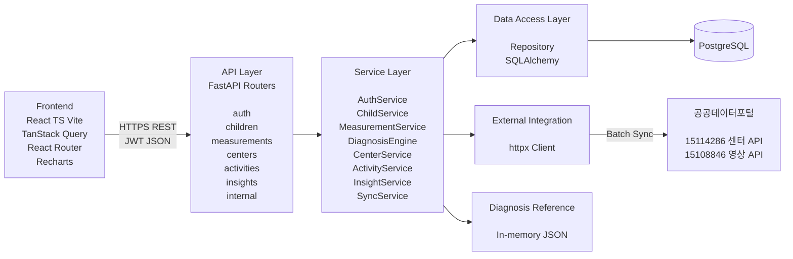

# 아이쑥크림(icecream) 시스템 아키텍처

> 유아기 체력 진단·연계·추적 서비스의 시스템 구성, 레이어 설계, 프로젝트 구조, 데이터 흐름 정의.
> 스택: FastAPI + PostgreSQL(Neon, 백엔드) / React + TypeScript + Vite(프론트) / Vercel 배포.
> 로컬 개발에서는 Docker Compose 또는 로컬 PostgreSQL을 사용할 수 있다.

## 1. 아키텍처 개요

### 1.1 설계 목표
- 공모 시제품 범위에서 **작동하는 데모**를 안정적으로 구현(핵심 루프 끊김 없음).
- 외부 공공 API 장애가 핵심 기능(진단·기록)을 막지 않도록 **의존성 격리**.
- 판정 로직을 **테스트 가능한 순수 함수**로 분리(공식 기준표 재현성 확보).
- 단일 배포 단위(모놀리식)로 운영 단순화. 서비스 분리는 확장 시 고려.

### 1.2 스타일
- 백엔드: **레이어드 모놀리식**(API → Service → Repository → DB).
- 프론트: SPA(반응형 웹), 서버 상태는 TanStack Query로 관리.
- 통신: REST(JSON), 인증은 JWT Bearer.

## 2. 시스템 구성도



```
┌─────────────────────────────────────────────────────────┐
│                        Client                            │
│   React + TS + Vite (반응형 웹, 모바일 우선)              │
│   TanStack Query · React Router · Recharts               │
└───────────────────────────┬─────────────────────────────┘
                            │ HTTPS / REST (JSON, JWT)
┌───────────────────────────▼─────────────────────────────┐
│                   FastAPI Application                     │
│                                                           │
│  ┌──────────── API Layer (routers) ─────────────┐         │
│  │ auth · children · measurements · centers      │         │
│  │ activities · insights · internal              │         │
│  └───────────────────┬──────────────────────────┘         │
│                      │                                    │
│  ┌──────────── Service Layer ────────────────────┐        │
│  │ AuthService · ChildService · MeasurementSvc   │        │
│  │ DiagnosisEngine(순수) · CenterSvc · ActivitySvc│        │
│  │ InsightService · SyncService                  │        │
│  └───────┬───────────────────────┬───────────────┘        │
│          │                       │                        │
│  ┌───────▼────────┐   ┌──────────▼──────────┐             │
│  │ Repository     │   │ External Client     │             │
│  │ (SQLAlchemy)   │   │ (httpx → 공공 API)  │             │
│  └───────┬────────┘   └──────────┬──────────┘             │
│          │                       │                        │
│  ┌───────▼────────┐   In-memory: 기준표 JSON(진단 근거)   │
│  │  PostgreSQL    │                                       │
│  └────────────────┘                                       │
└───────────────────────────┬─────────────────────────────┘
                            │ (배치)
                    ┌────────▼────────┐
                    │  공공데이터포털  │
                    │ 15114286(센터)  │
                    │ 15108846(영상)  │
                    └─────────────────┘
```

## 3. 레이어 책임

| 레이어 | 책임 | 원칙 |
| --- | --- | --- |
| API (routers) | 요청 검증(Pydantic), 인증 확인, 응답 래핑(success/data/error), ID 인코딩/디코딩 | 비즈니스 로직 없음. Entity 직접 반환 금지 |
| Service | 유스케이스 조합, 트랜잭션 경계, 권한 검증 | Repository·External·Engine 조율 |
| DiagnosisEngine | 측정값 → 등급 판정(순수 함수) | I/O 없음. 기준표 JSON 입력, 결정적 출력 |
| Repository | DB CRUD, 쿼리 | SQLAlchemy 세션 관리. SQL만 담당 |
| External Client | 공공 API 호출(httpx) | 재시도·타임아웃·장애 격리 |

> DiagnosisEngine을 I/O 없는 순수 함수로 분리한 것이 핵심. 기준표 JSON과 측정값만 받아 등급을 반환하므로 단위 테스트로 공식 기준 재현성을 완전히 검증할 수 있다.

## 4. 프로젝트 구조 (monorepo)

```
icecream/
├─ backend/
│  ├─ app/
│  │  ├─ main.py                  # FastAPI 앱 진입점(로컬/ASGI)
│  │  ├─ core/
│  │  │  ├─ config.py             # 환경설정(Pydantic Settings)
│  │  │  ├─ security.py           # JWT, 비밀번호 해시(Argon2id)
│  │  │  ├─ deps.py               # 의존성(현재 사용자 등)
│  │  │  ├─ response.py           # 공통 응답 래퍼
│  │  │  ├─ errors.py             # 에러 코드·예외
│  │  │  └─ ids.py                # {resource}_{id} 인코딩/디코딩
│  │  ├─ api/
│  │  │  ├─ common.py             # 공통 응답·페이지네이션
│  │  │  └─ v1/
│  │  │  ├─ auth.py
│  │  │  ├─ children.py
│  │  │  ├─ measurements.py
│  │  │  ├─ centers.py
│  │  │  ├─ activities.py
│  │  │  ├─ insights.py
│  │  │  └─ internal.py
│  │  ├─ services/
│  │  │  ├─ auth_service.py
│  │  │  ├─ child_service.py
│  │  │  ├─ measurement_service.py
│  │  │  ├─ diagnosis_engine.py   # 순수 판정 로직
│  │  │  ├─ center_service.py
│  │  │  ├─ activity_service.py
│  │  │  ├─ insight_service.py
│  │  │  └─ sync_service.py
│  │  ├─ repositories/
│  │  │  ├─ parent_repo.py
│  │  │  ├─ child_repo.py
│  │  │  ├─ measurement_repo.py
│  │  │  ├─ center_repo.py
│  │  │  └─ activity_repo.py
│  │  ├─ models/
│  │  │  └─ entities.py            # SQLAlchemy ORM 모델 6종
│  │  ├─ schemas.py                # Pydantic 요청/응답 DTO
│  │  ├─ external/
│  │  │  └─ kspo_client.py        # 공공 API httpx 클라이언트
│  │  └─ resources/
│  │     └─ fitness_grade_criteria.json  # 기준표(형상관리 대상)
│  ├─ alembic/                    # 마이그레이션
│  ├─ tests/
│  │  ├─ test_diagnosis_engine.py # 판정 로직 단위 테스트
│  │  └─ ...
│  ├─ index.py                     # Vercel FastAPI 진입점(예정)
│  ├─ pyproject.toml
│  └─ Dockerfile
├─ frontend/
│  ├─ src/
│  │  ├─ main.tsx
│  │  ├─ App.tsx
│  │  ├─ routes/                  # 화면 라우팅
│  │  ├─ pages/                   # 온보딩·홈·진단·결과·기록·센터·활동·인사이트
│  │  ├─ features/                # 도메인별 훅·컴포넌트
│  │  │  ├─ auth/
│  │  │  ├─ children/
│  │  │  ├─ measurement/
│  │  │  ├─ center/
│  │  │  └─ insight/
│  │  ├─ components/              # 공통 UI(등급 배지, 카드 등)
│  │  ├─ api/                     # API 클라이언트, TanStack Query 훅
│  │  ├─ lib/                     # 유틸(개월수 계산, 포맷)
│  │  └─ styles/                  # Tailwind 설정·토큰
│  ├─ package.json
│  ├─ vite.config.ts
│  └─ Dockerfile
├─ docker-compose.yml             # backend + frontend + postgres
├─ .gitignore
└─ README.md
```

## 5. 핵심 데이터 흐름

### 5.1 진단 (DIA — 핵심 루프)
```
[Client] 측정값 입력
   │ POST /children/{id}/measurements
   ▼
[measurements router] Pydantic 검증 · JWT 확인 · childId 디코딩
   ▼
[MeasurementService]
   ├─ 권한 검증(자녀 소유 확인)
   ├─ 개월수 계산(측정 시점 스냅샷)
   ├─ DiagnosisEngine.judge(gender, months, items, 기준표JSON)
   │     → 종합 등급 + 항목별 등급 + 강·약 프로파일
   └─ Repository: measurement + measurement_item 저장(트랜잭션)
   ▼
[response] success/data 래핑, ID 인코딩 → 판정 결과 반환
```
> DiagnosisEngine은 DB·외부 호출 없이 메모리의 기준표 JSON만 참조 → 즉시(1초 이내) 응답, 외부 장애 무관.

### 5.2 센터/활동 (외부 의존, 격리)
```
[Client] → GET /centers or /activities
   ▼
[Service] → Repository(캐시 DB) 조회  ← SyncService가 배치로 채워둠
   ▼
캐시 히트 → 즉시 응답
캐시 미스/외부 장애 → stale 플래그 또는 503, 핵심 기능은 영향 없음
```

### 5.3 데이터 동기화 (배치)
```
[SyncService] (Vercel Cron/수동 트리거)
   ▼
[kspo_client(httpx)] 공공 API 15114286 및 15108846의 `TODZ_VDO_TRNG_GUIDE_I` 호출
   ▼
extId(`file_nm`) 기준 upsert · 영상 프레임 중복 제거 · 원본 분류값 정규화
   ▼
[center/activity_video 테이블] 갱신, syncedAt 기록
```

## 6. 핵심 설계 결정

| 결정 | 선택 | 이유 |
| --- | --- | --- |
| 판정 기준표 위치 | 앱 메모리(JSON) | 정적 데이터. 매 진단 즉시 참조, DB 조회 불필요 |
| 판정 로직 | 순수 함수(DiagnosisEngine) | I/O 분리로 완전한 단위 테스트·재현성 |
| 측정 항목 저장 | long 구조(measurement_item) | 미입력 자연 처리, 항목별 시계열 쿼리 단순 |
| 등급 저장 | measurement.grade 스냅샷 | 기준표 개정돼도 측정 당시 등급 보존 |
| 공공 API | DB 캐시 + 배치 동기화 | 외부 장애 격리, 응답 속도 |
| 외부 노출 ID | {resource}_{id} 인코딩 | Auto Increment 직접 노출 회피 |
| 배포 | Vercel + Neon PostgreSQL | 프론트·FastAPI 배포 단순화와 관리형 DB 활용 |

## 7. 인증·보안

- JWT Bearer. parentId는 토큰에서만 추출(클라이언트 값 불신뢰).
- 비밀번호 Argon2id 해시. 평문·양방향 저장 금지.
- 소유 리소스는 Service 레이어에서 소유자 일치 검증 후 접근.
- 시크릿은 환경변수(.env, 커밋 제외). 예시는 .env.example로 공유.

## 8. 운영·관측 (시제품 범위)

- 요청 로그: traceId · method · path · status · elapsed.
- OpenAPI 문서 자동 제공(`/docs`).
- 헬스체크 엔드포인트(`/health`)로 컨테이너 상태 확인.
- DB 마이그레이션은 Alembic으로 버전 관리.
- 운영 동기화는 Vercel Cron이 인증된 배치 엔드포인트를 호출하는 방식으로 구성한다.
- Cron 요청과 관리자 수동 동기화는 별도 인증 수단으로 분리한다.

## 9. 확장 고려사항 (시제품 이후)

- 지역 인사이트 집계 캐시(Redis) 도입 시 InsightService에 캐시 레이어 추가.
- 사용자 증가 시 measurement 조회 인덱스·파티셔닝 검토.
- 알림·리마인더는 이벤트 기반(비동기)으로 분리 가능.
- 서비스 분리가 필요해지면 auth/measurement 경계부터 후보.
